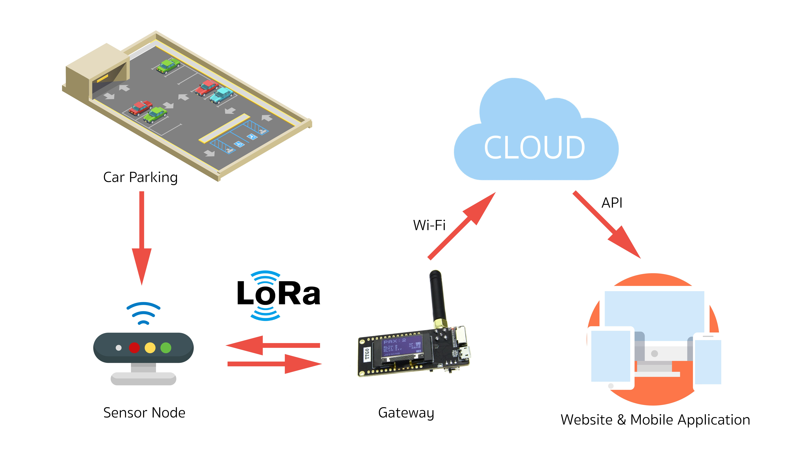

# Smart Parking System Project

### Year 4 - Information Engineering Project. ###

    
   This purposed of this project, is to help patient that have problem with  their memory ,intellect or their daily life. This project 
will increase facilitate of caregiver and increase safety of the patient. Even though the patient has left the area, you can find them accurately. By using small embedded system  consists of 4 devices as Tracking Device, Alarm Device, Infrared Sender Device and Mobile Phone. This project work in 2 main cases. In first case will immediately warning when the patient going out from limit area. The limit area was defined by using Infrared ray (IR) that was spread out from Infrared Sender device. Moreover the alarm device will make a loud noise for alert to closest caregivers. In second case, when your patient has lost. We still can find position of patient with tracking device. By sending defined text in SMS to tracking device after that tracking device will send location of patient at that time back to caregiver’s mobile phone in form of  Google map link.

---

**KMITL**
